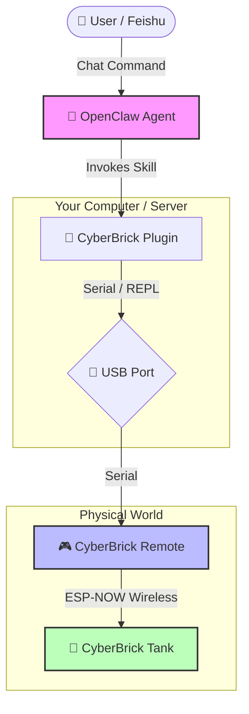

# CyberBrick Plugin for OpenClaw


**Giving Life to CyberBrick Devices via AI**

**English** | [中文](./README_CN.md)

This plugin bridges the gap between [OpenClaw](https://github.com/openclaw) AI agents and [CyberBrick](https://cyberbrick.cn) hardware. It empowers any CyberBrick device (Mini T Tank, robotic arms, etc.) with autonomous capabilities, turning static hardware into intelligent, interactive companions.

## Demo

> Watch OpenClaw and CyberBrick transform a Mini T Tank into a free-roaming bot!

[](https://www.youtube.com/watch?v=vC2DL5KLIQE)

## Mission

Our goal is to **animate the physical world** through AI. By connecting CyberBrick's versatile hardware ecosystem with OpenClaw's powerful agent framework, we enable:

- 🤖 **Autonomous Behavior**: Devices that explore, react, and make decisions independently.
- 🎭 **Personality Injection**: Programmable "souls" like the "Hyperactive Kid" persona.
- 🔌 **Universal Control**: A unified driver interface for all standard CyberBrick pinout configurations.

## Architecture


How your AI command travels from the cloud to the physical world:



1.  **User**: Sends a command (e.g., "Dance!") via Feishu/Lark or CLI.
2.  **OpenClaw**: Processes the intent and calls the `cyberbrick-driver` skill.
3.  **Plugin**: Converts the skill call into MicroPython code.
4.  **USB**: Sends code to the CyberBrick Remote via Serial (REPL).
5.  **Remote**: Executes the code and sends wireless commands (ESP-NOW) to the Tank.
6.  **Tank**: Receives commands and moves its motors!

## Core Capabilities

This plugin currently provides the following skills:

1.  **Universal Driver (`cyberbrick_driver/cyberbrick_driver.py`)**:
    -   Precise motor and servo control (1000Hz PWM).
    -   Standardized movement (Forward, Backward, Turn).
    -   Action triggers (Fire, Turret elevation).
    -   Full system diagnostics.

2.  **Autonomous Wander (`cyberbrick_wander/cyberbrick_wander.py`)**:
    -   A "Hyperactive Kid" personality engine.
    -   Self-driven exploration with erratic, playful behaviors.
    -   Complex macro actions (Dance, Panic, Celebrate).

## Usage

### Hardware Setup

Before invoking any skills, ensure your hardware is ready:

1.  **Prepare Devices**: You need a **CyberBrick Remote** (Transmitter) and a **CyberBrick Tank/Robot** (Receiver).
2.  **Pairing**: Follow the [official CyberBrick guide](https://wiki.bambulab.com/en/cyberbrick) to pair your Remote and Tank via ESP-NOW.
3.  **Connection**: Connect the **CyberBrick Remote** to your computer via USB.
4.  **Power On**: Turn on both the Remote and the Tank. Ensure they are paired (usually indicated by a solid LED).

### Invoking Skills

Skills are registered in `SKILL.md` files within each subdirectory and can be invoked naturally by OpenClaw agents.

**Example Prompts:**
- "Start wandering around."
- "Perform a dance routine."
- "Run a hardware self-test."
- "Move forward at full speed for 3 seconds."

> **Note**: The Agent communicates with the *Remote* via USB, which then wirelessly controls the *Tank*.

## Directory Structure

- `cyberbrick_driver/`: Contains the driver skill and low-level hardware abstraction layer.
- `cyberbrick_wander/`: Contains the wander skill and high-level behavioral logic.
- `README.md`: Project documentation.

## Installation & Configuration

### Prerequisites

1.  **Python 3.x**: Ensure Python 3 is installed on your system.
2.  **Dependencies**: Install the required Python packages.
    ```bash
    pip3 install -r requirements.txt
    ```

## Skill Installation

To make these skills available to **all OpenClaw Agents** (Global Installation), or just for a specific project, follow the instructions below.

### Option 1: Global Installation (Recommended)

This will install the skills into OpenClaw's global skill directory, making them accessible to any agent in any workspace.

1.  **Create the global skills directory** (if it doesn't exist):
    ```bash
    mkdir -p ~/.openclaw/skills
    ```

2.  **Clone the repository**:
    ```bash
    git clone https://github.com/unbug/CyberBrickClaw.git ~/.openclaw/skills/cyberbrick-claw
    ```

### Option 2: Agent Workspace-specific Installation

If you only want to use these skills in a specific **Agent Workspace** (the project directory the Agent is currently operating in).

1.  **Navigate to the Agent's workspace root**:
    ```bash
    cd /path/to/agent/workspace
    ```

2.  **Clone the repository**:
    ```bash
    mkdir -p skills
    git clone https://github.com/unbug/CyberBrickClaw.git skills/cyberbrick-claw
    ```

### Option 3: Development Mode (Symlink)

If you are developing these skills and want changes to be reflected globally without copying files.

```bash
mkdir -p ~/.openclaw/skills
ln -s $(pwd)/cyberbrick_driver ~/.openclaw/skills/cyberbrick-driver
ln -s $(pwd)/cyberbrick_wander ~/.openclaw/skills/cyberbrick-wander
```

## Registration

OpenClaw automatically detects `SKILL.md` files in its skill search paths (e.g., `~/.openclaw/skills/` or `./skills/`). No further configuration is usually required once the files are in place.

### Configuration

The CyberBrick Driver needs to know which serial port your device is connected to. It attempts to auto-detect the port, but you can explicitly configure it if needed.

**Option 1: Auto-Detection (Recommended)**
The driver will automatically look for devices with names like "CyberBrick", "usbmodem", "USB Serial", or "CP210". Just run the commands, and it should work.

**Option 2: Environment Variable**
Set the `CYBERBRICK_PORT` environment variable to your specific serial port.
```bash
# macOS / Linux
export CYBERBRICK_PORT=/dev/tty.usbmodem12345

# Windows
set CYBERBRICK_PORT=COM3
```

**Option 3: Command Line Argument**
Pass the `--port` argument when running the driver directly.
```bash
python3 cyberbrick_driver/cyberbrick_driver.py test --port /dev/tty.usbmodem12345
```

### Troubleshooting

- **Permission Denied**: If you get a permission error accessing the serial port, you may need to add your user to the `dialout` group (Linux) or check your driver settings.
- **Device Not Found**: Ensure the CyberBrick is powered on and connected via USB. Check if it appears in `ls /dev/tty.*` (macOS/Linux) or Device Manager (Windows).

---
*Powered by OpenClaw & CyberBrick*
