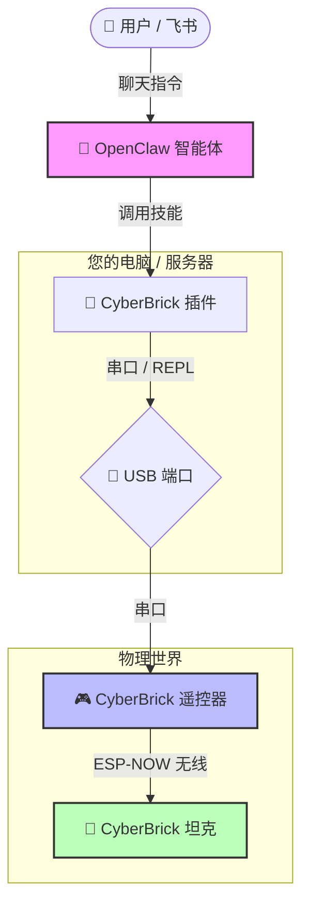

# CyberBrick Plugin for OpenClaw


**通过 AI 赋予 CyberBrick 设备生命**

[English](./README.md) | **中文**

本插件架起了 [OpenClaw](https://github.com/openclaw) AI 智能体与 [CyberBrick (元气砖)](https://cyberbrick.cn) 硬件之间的桥梁。它赋予任何 CyberBrick 设备（如 Mini T 坦克、机械臂等）自主能力，将静态硬件转变为智能、互动的伙伴。

## 演示 (Demo)

> 观看 OpenClaw 和 CyberBrick 如何将 Mini T 坦克变成一个自由漫游的机器人！

[](https://www.youtube.com/watch?v=vC2DL5KLIQE)

## 使命

我们的目标是通过 AI **让物理世界动起来**。通过将 CyberBrick 多功能的硬件生态系统与 OpenClaw 强大的智能体框架连接起来，我们实现了：

- 🤖 **自主行为**：设备能够独立探索、反应和决策。
- 🎭 **注入个性**：可编程的“灵魂”，例如“熊孩子”人格。
- 🔌 **通用控制**：适用于所有标准 CyberBrick 引脚配置的统一驱动接口。

## 架构

您的 AI 指令是如何从云端传输到物理世界的：




1.  **用户**：通过飞书/Lark 或命令行发送指令（例如：“跳个舞！”）。
2.  **OpenClaw**：解析意图并调用 `cyberbrick-driver` 技能。
3.  **插件**：将技能调用转换为 MicroPython 代码。
4.  **USB**：通过串口 (REPL) 将代码发送到 CyberBrick 遥控器。
5.  **遥控器**：执行代码并通过无线指令 (ESP-NOW) 控制坦克。
6.  **坦克**：接收指令并驱动电机运动！

## 核心能力

本插件目前提供以下技能：

1.  **通用驱动 (`cyberbrick_driver/cyberbrick_driver.py`)**：
    -   精确的电机和舵机控制 (1000Hz PWM)。
    -   标准化移动指令（前进、后退、转向）。
    -   动作触发（开火、炮塔俯仰）。
    -   完整的系统自检。

2.  **自主漫游 (`cyberbrick_wander/cyberbrick_wander.py`)**：
    -   “熊孩子”人格引擎。
    -   包含古怪、顽皮行为的自主探索模式。
    -   复杂的宏动作（跳舞、惊慌、庆祝）。

## 使用方法

### 硬件准备

在使用任何技能之前，请确保您的硬件已准备就绪：

1.  **设备准备**：您需要一个 **CyberBrick 遥控器**（发射端）和一个 **CyberBrick 坦克/机器人**（接收端）。
2.  **配对**：请使用 **CyberBrick App** 完成遥控器与坦克的配对。如有需要，可参考 [官方指南](https://wiki.bambulab.com/zh/cyberbrick)。
3.  **连接**：将 **CyberBrick 遥控器** 通过 USB 线连接到 **运行 OpenClaw 的电脑**。
4.  **开机**：同时开启遥控器和坦克的电源。确保它们已成功配对（通常 LED 指示灯常亮）。

### 调用技能

技能注册在每个子目录的 `SKILL.md` 文件中，OpenClaw 智能体可以自然地调用它们。

**示例提示词 (Prompts):**
- "开始到处转转。" (Start wandering around.)
- "表演一段舞蹈。" (Perform a dance routine.)
- "运行硬件自检。" (Run a hardware self-test.)
- "全速前进 3 秒钟。" (Move forward at full speed for 3 seconds.)

> **注意**：智能体是通过 USB 与*遥控器*通信，再由遥控器无线控制*坦克*。

## 目录结构

- `cyberbrick_driver/`: 包含驱动技能和底层硬件抽象层。
- `cyberbrick_wander/`: 包含漫游技能和高层行为逻辑。
- `README.md`: 项目文档。

## 安装与配置

### 前置条件

1.  **Python 3.x**：确保您的系统已安装 Python 3。
2.  **依赖库**：安装所需的 Python 包。
    ```bash
    pip3 install -r requirements.txt
    ```

## 技能安装

要让 **所有 OpenClaw 智能体**（全局安装）或仅特定项目使用这些技能，请按照以下说明操作。

### 选项 1：全局安装（推荐）

这会将技能安装到 OpenClaw 的全局技能目录中，使其可供任何工作区中的任何智能体使用。

1.  **创建全局技能目录**（如果不存在）：
    ```bash
    mkdir -p ~/.openclaw/skills
    ```

2.  **克隆仓库**：
    ```bash
    git clone https://github.com/unbug/CyberClaw.git ~/.openclaw/skills/cyberbrick-claw
    ```

### 选项 2：Agent 工作区特定安装

如果您只想在特定的 **Agent 工作区**（Agent 当前操作的项目目录）中使用这些技能。

1.  **导航到 Agent 的工作区根目录**：
    ```bash
    cd /path/to/agent/workspace
    ```

2.  **克隆仓库**：
    ```bash
    mkdir -p skills
    git clone https://github.com/unbug/CyberClaw.git skills/cyberbrick-claw
    ```

### 选项 3：开发模式（软链接）

如果您正在开发这些技能，并希望更改能全局生效而无需复制文件。

```bash
mkdir -p ~/.openclaw/skills
ln -s $(pwd)/cyberbrick_driver ~/.openclaw/skills/cyberbrick-driver
ln -s $(pwd)/cyberbrick_wander ~/.openclaw/skills/cyberbrick-wander
```

## 注册

OpenClaw 会自动检测其技能搜索路径（例如 `~/.openclaw/skills/` 或 `./skills/`）中的 `SKILL.md` 文件。文件就位后通常无需进一步配置。

### 配置

CyberBrick 驱动程序需要知道您的设备连接到了哪个串口。它会尝试自动检测端口，但如果需要，您也可以显式配置。

**选项 1：自动检测（推荐）**
驱动程序会自动查找名称包含 "CyberBrick"、"usbmodem"、"USB Serial" 或 "CP210" 的设备。直接运行命令，通常即可工作。

**选项 2：环境变量**
将 `CYBERBRICK_PORT` 环境变量设置为您的特定串口。
```bash
# macOS / Linux
export CYBERBRICK_PORT=/dev/tty.usbmodem12345

# Windows
set CYBERBRICK_PORT=COM3
```

**选项 3：命令行参数**
直接运行驱动程序时传递 `--port` 参数。
```bash
python3 cyberbrick_driver/cyberbrick_driver.py test --port /dev/tty.usbmodem12345
```

### 故障排除

- **权限被拒绝 (Permission Denied)**：如果在访问串口时遇到权限错误，您可能需要将用户添加到 `dialout` 组 (Linux) 或检查驱动程序设置。
- **未找到设备 (Device Not Found)**：确保 CyberBrick 已通电并通过 USB 连接。检查它是否出现在 `ls /dev/tty.*` (macOS/Linux) 或设备管理器 (Windows) 中。

---
*Powered by OpenClaw & CyberBrick*
